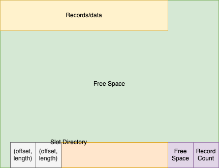

## Project 1 Report

### 1. Basic information
 - Team #: 4
 - Github Repo Link: https://github.com/UCI-Chenli-teaching/cs222-fall20-team-4
 - Student 1 UCI NetID: srirar1
 - Student 1 Name: Sriram Rao
 - Student 2 UCI NetID (if applicable): subhamok
 - Student 2 Name (if applicable): Subhamoy Karmakar

### 2. Internal Record Format
- Show your record format design.

We keep fixed sized slots for the number of fields (N) and the N offsets to the end of each field value  

- Describe how you store a null field.

We store the offset as an invalid number (-1) for null values.

- Describe how you store a VarChar field.

We have the memory offsets specify the end of the corresponding field which will help us for variable length fields.

- Describe how your record design satisfies O(1) field access.

While accessing a field, following are the things we have access to beforehand: record schema and amount of memory being used for record fields and offsets.
Since we know the number of bytes per metadata field (offset or record size) and memory offsets to each field, we can:
1. Find the offset for field (N-1) and offset for field N in constant time
2. Use these to access the field N.

### 3. Page Format
- Show your page format design.

 We keep a vector of records at the start of the page and the slot directory at the end.
 This leaves all free space as one fragment instead of having it distributed in between records and possibly even within the slot directory.
 On update/delete of records, we plan on shifting the records to uilize the newly freed space.
 We will update the documentation with our plan for slot directory on deletion of a record.

The slot directory is similar to the design described in the lecture.
* I store a vector with the following information: memory offset to the record inside the current page and record length.
* I have the following fixed length information: number of records and amount of free space remaining.
* I store these as _short_ variables.
* The number of records and free space are stored at the end of the page so that access to these can be a constant time operation.
* The vector with record offsets expands into the free space with inserts.

### 4. Page Management
- Show your algorithm of finding next available-space page when inserting a record.
* Start from the last page
* If this page has enough space (for data, offsets, field/attribute count and extra slot), use this page
* Go backward to previous pages
* If no page is found, return -1 to indicate that a new page must be added.

- How many hidden pages are utilized in your design?

Currently, in this manner I use 1 hidden page to store the read, write and append counters, and other private metadata like the number of data pages and a vector of page numbers to available free space (pageSpaceMap\[pageNumber\] will return the free space in that page).

- Show your hidden page(s) format design if applicable

Currently, we store the three unsigned int counters read, write and append page counters, and the number of data pages.
I also store a vector of page number to available free space. 
One page will not be able to hold the page-space map after a certain point.
Proposal to handle this (this is not implemented right now and is only a proposal): we can, then, add a field to hold the page number with the continuation for this vector and use that page number as a hidden page as well. 

### 5. Implementation Detail
- Other implementation details goes here.

I have started with using cstdio for file handling (i.e. fopen, fread, etc). I learnt quite late that the fstream methods are much more usable. I will change this to use fstream if needed later on.

To store varchar types, we read 4-byte length specifier to access the varchar value from the input bytes. I do not store these bytes on file: I only store the exact length of varchar data and use the offsets to appropriately signify the end of the field.

### 6. Member contribution (for team of two)
We discussed the design for PFM, Record, Slot Directory and Page at first.
We divided the code to be written. For the first project, Sriram started with the PagedFileManager and FileHandle. Subhamoy started with the models for Record and Slot Directory. In the record manager, Subhamoy wrote the printRecord method and Sriram wrote the rest.

### 7. Other (optional)
- Freely use this section to tell us about things that are related to the project 1, but not related to the other sections (optional)

I just want to mention that this is a very interesting project and helps us understand very well the intricacies of a DBMS. 
The scope for project 1 was rightly set so that it gave us time to get comfortable with C++ as well.

- Feedback on the project to help improve the project. (optional)
