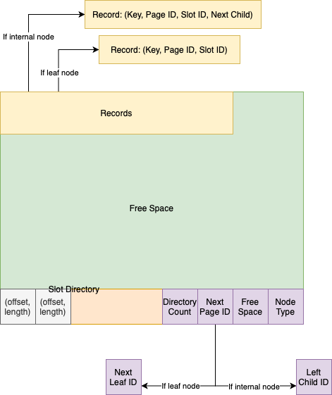

## Project 3 Report


### 1. Basic information
 - Team #: 4
 - Github Repo Link: https://github.com/UCI-Chenli-teaching/cs222-fall20-team-4
 - Student 1 UCI NetID: srirar1
 - Student 1 Name: Sriram Rao


### 2. Meta-data page in an index file
- Show your meta-data page of an index design if you have any. 

  My metadata page is very similar to the paged file manager in P1: 
  1. The first hidden page stores the three counters (read, write and append).
  2. The second hidden page stores the page ID of the root node in the B+ Tree.

### 3. Index Entry Format
- Show your index entry design (structure). 

  Since I have attempted the extra credit of duplicate entries spanning multiple pages, my index entries have the key and also have the record IDs.

 - Entries on internal nodes: 
    The records on internal nodes can be thought of as having a key and next page pointer in each record.
    1. Key: (attribute value, page number, slot number)
    2. Next child page number
    These are arranged as follows. 
    If we have two records R1 and R2, the tree's key constraint can be written as:
      ```
      R1.key <= R1.next_child's minimum value < R2.key
      ```
    If we have k keys, this design allows storing k child pages. 
    The (k+1)th child page is stored separately in the page dictionary. 
    The child page I chose to store here is the left-most child.
      ```
      dictionary.child_page's minimum value < R1.first_key
      ```
     
  - Entries on leaf nodes:
  Entries on the leaf node have the key value and the corresponding record ID, as expected. 
  Duplicate keys are stored separately, i.e., there is no record ID list per key. For duplicate keys, I just store them as separate records:
    ```
    key1, (page1, slot1); key1, (page1, slot2); ... 
    ```

### 4. Page Format
- Show your internal-page (non-leaf node) design.

  Both the nodes have very similar design, which is also similar to the design in P1. 
  We have a page directory to store
  1. Node type (internal or leaf) 
  2. Free space remaining, 
  3. Next node page ID
  4. Directory size, 
  5. A vector with record offsets and lengths: slot directory
  
  An additional part here is the left-most child (stored in the next node page ID) as explained earlier.

  The record entry here contains: 
    1. The attribute value which is the actual key in the index 
    2. The record ID in the heap file 
    3. The next child page ID

  The following diagram illustrates this. 
The "next page" is used according to need by the internal node and the leaf node.



- Show your leaf-page (leaf node) design.

    We have a page directory to store
    1. Node type (internal or leaf) 
    2. Free space remaining, 
    3. Next leaf page ID
    4. Directory size, 
    5. A vector with record offsets and lengths: slot directory
    
    The record entry here contains: 
    1. The attribute value which is the actual key in the index 
    2. The record ID in the heap file 

### 5. Describe the following operation logic.
- Split
  
  The insertion algorithm is almost exactly as described in the textbook. 
  Therefore, I will not go into the details of the insertion algorithm here.
  A leaf node is split when it does not have enough space for a new key entry. This can be checked using the key's size and the available free space in the leaf node.
  When a leaf node is split, the insertion child pointer is set with 
     1. The minimum key value of the new node is **copied** (copy up).
     2. Its key length
     3. The page ID of the new leaf node after it is written to disk.

  When control flow returns to an internal node, if a new node is present, it is added similarly. 
  If there is no space available, the node is split and the insertion child pointer is set with:
     1. The minimum key value in the new node is **pushed** (push up). This key is not present in the new internal node.
     2. The key length.
     3. The page ID of the new internal node after writing to disk.
  
  The node split logic specifically, according to this algorithm, is implemented in ```node.cc``` as follows:
  1. Iterate through the directory from start to find the index that pushes the occupied space to more than half of the page.
  2. Set the start of copy to the record that causes the occupied space to cross half.
  3. If the new key was to be added in the left half of the node, set the start of copy to the previous record.
  4. If this is an internal node, 
     1. Set the key of the start of copy record as minimum key value.
     2. Also set this child page as the left-most page of the new node.
     3. Erase this record from the current node.
  5. For each directory entry from the start of copy to last directory entry,
     1. Copy the record (key, record ID, the child page number) using offset and length information stored in the directory.
     2. Update new node's directory
     3. Update offsets in the current node.
     3. Erase this entry in the current node's directory.
  
  *Reason for step **v.c**:* While inserting records, I only ensure that the directory index is according to the B+ tree ordering but the record itself is added at the start of available free space.
  Therefore, I need to check and correct all offsets while moving/editing a record in the index node. 
  This makes the node split an expensive operation. The assumption is that node-split is rare after building the index. 
  This is reasonable in many database systems: the insert operations are expected to be expensive.
  But this method could make the performance in an OLTP system (with regular inserts/updates) slow.   

- Rotation (if applicable): Node split logic does not involve rotation. Not applicable.

- Merge/non-lazy deletion (if applicable): Not applicable.

- Duplicate key span in a page
  
  Duplicate keys are stored just like normal records in the page:
  ```
  (attribute value, page number, slot number)
  ``` 
  During the conversion to JSON string, I keep a check and compare the key's attribute value to print it as a record list.

- Duplicate key span multiple pages (if applicable)
  
  The above mentioned key structure (using record IDs as part of key), as suggested by Prof. Chen Li, helps solve this problem.
  Key comparison for B+ tree key constraint is extended from just key1 < key2 to:
  ```
  (key1 < key2) OR 
  (key1 == key2 AND 
    (page1 < page2 OR 
    (page1 == page2 AND slot1 < slot2)))
  ``` 
  This simple extension helps allow duplicate keys to span multiple leaf nodes.

### 6. Implementation Detail
- Have you added your own module or source file (.cc or .h)? 
  Clearly list the changes on files and CMakeLists.txt, if any.

  The header file ```ix.h``` includes one other class: ```Node```.
  Files in the ```CMakeLists.txt``` for index manager:
  1. ix.cc 
  2. ixfilehandle.cc
  3. ixscanner.cc: The scan iterator class.
  4. node.cc: Represents the internal and leaf nodes in the tree.
  5. compare_utils.h: util methods to compare two byte arrays based on the passed in AttrType.
  6. parse_utils.h: util methods to parse a byte array into the passed in AttrType

- Other implementation details:
  
  - The insert method almost exactly follows the algorithm explained in the textbook.
  - The delete method does a lazy delete by copying over necessary bytes to converge the occupied space and by setting the directory entry to -1. 
  The directory is handled this way so that the cursor of an ongoing scan is not affected. 
  The directory is cleaned up before a node splits.
  - The printJson method starts from the root node and recursively calls each child to incrementally form the JSON string. No library is used here.
  - For the scan operation, if there is no ```lowKey``` given, we start by following the left-most child pointers to reach the first (and smallest) entry in the B+ tree.
  Henceforth, the condition is checked for each scanned entry using the method ```IX_ScanIterator::meetsCondition(void *key)```. 

### 7. Member contribution (for team of two)
- Explain how you distribute the workload in team.
  
  I am the only person in my team.

### 8. Other (optional)
- Freely use this section to tell us about things that are related to the project 3, but not related to the other sections (optional)

  Nothing to add here.

- Feedback on the project to help improve the project. (optional)

  I felt that some of the test cases were a little pedantic (e.g. expecting two append operations on first insert into the tree).
Maybe such instances could be relaxed a little, since they do not make much of a difference to the actual formation of the B+ tree and its effectiveness.
